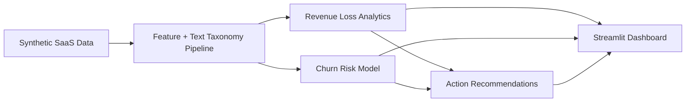

# Revenue Leak Detector

An end-to-end SaaS analytics system that explains **where revenue is leaking**, **why it is leaking**, and **which actions should be prioritized first**.

Includes Streamlit deploymenet capabilities (Guide mentioned below)

This repo implements the full scope in `project_spec.md`: synthetic data generation, text classification, churn-risk modeling, revenue impact quantification, and an interactive Streamlit dashboard.

It now also includes a Tableau conversion pack (`tableau/`) that mirrors the Streamlit dashboard sections with Tableau-ready exports, calculated field definitions, and a one-to-one worksheet/dashboard build guide.

## 30-second pitch

I built a full revenue intelligence system for a SaaS company simulation. It combines product usage, support tickets, sales notes, and cancellations to detect root causes of revenue leakage, score churn risk, estimate revenue at risk, and prioritize high-impact operational fixes in an interactive dashboard.

## What this repository does

- Simulates a realistic SaaS company (`DesignFlow`) and unifies 6 datasets:
  - accounts
  - deals
  - product usage
  - support tickets
  - sales notes
  - cancellations
- Classifies unstructured text into a business taxonomy:
  - Commercial
  - Product
  - Operational
  - Competitive
  - Adoption / Value Realization
- Builds account-level churn-risk scores and estimates revenue at risk.
- Quantifies revenue leakage from:
  - lost deals
  - churned subscriptions
- Produces recommendations tied to top leakage categories.
- Delivers all results in a Streamlit app for exploration and decision-making.

## What I built (my contribution)

- Designed and implemented the full analytics pipeline in `src/revenue_leak/`.
- Built taxonomy-driven text classification for sales/support/cancellation evidence (`text_taxonomy.py`).
- Engineered account-level features from usage, support, and deal history (`features.py`).
- Trained churn model and added threshold optimization for high-recall risk detection (`modeling.py`).
- Implemented revenue-loss aggregation by category, trend, and segment (`analytics.py`).
- Implemented recommendation engine that maps top root causes to actions (`recommendations.py`).
- Built interactive Streamlit app with KPIs, charts, risk tables, and evidence explorer (`app.py`).
- Wrote run pipeline entrypoint and project docs (`src/run_pipeline.py`, `docs/PROJECT_COMPLETION.md`).

## Reasoning behind the design

### 1) Business framing first, model second
The objective is not “best ML metric”; it is **revenue recovery prioritization**.  
So every stage is designed to answer: *which causes are losing the most money and what should the team do next?*

### 2) Multi-source evidence over single-table modeling
Revenue leakage is rarely visible in one table. I combined behavioral (`usage`), operational (`tickets`), commercial (`deals`), and sentiment/context (`notes`, `cancellations`) signals to improve root-cause coverage.

### 3) Recall-optimized churn scoring
For risk screening, missing true churners is expensive. I optimize threshold toward recall to surface more at-risk accounts, then rank by `estimated_monthly_revenue_at_risk` for practical prioritization.

### 4) Taxonomy + evidence transparency
Text classification is rule-driven and auditable. The dashboard exposes underlying text evidence so decisions are explainable to non-technical stakeholders.

## Latest run snapshot (pipeline output)

| Metric | Value |
|---|---:|
| Total modeled revenue leakage | `$1,647,354` |
| Lost-deal leakage | `$1,630,092` |
| Churn leakage | `$17,262` |
| Monthly revenue at risk (account scoring) | `$40,826.67` |
| High/Critical risk accounts | `221` |
| ROC-AUC | `0.6539` |
| Recall (optimized threshold) | `0.9057` |

Top revenue-loss categories:
1. `Product` — `$1,006,119`
2. `Competitive` — `$315,444`
3. `Commercial` — `$164,079`

## System architecture



## Core capabilities delivered

- **Data Generation**: realistic SaaS tables for accounts, deals, product usage, support tickets, sales notes, cancellations.
- **Text Classification**: maps support/sales/churn text into a revenue-loss taxonomy.
- **Churn Modeling**: Random Forest classifier with threshold tuning for higher recall.
- **Revenue Impact Analysis**:
  - leakage by category/subcategory
  - churn vs lost-deal split
  - monthly trends
  - segment-level exposure
- **Recommendations Engine**: category-prioritized operating actions.
- **Interactive App**:
  - KPI summary cards
  - category trend visualizations
  - at-risk account drill-down
  - segment impact view
  - evidence explorer for notes/tickets/cancellations

## Repository structure

```text
Revenue-Leak-Detector/
├── app.py
├── Dockerfile
├── docker-compose.yml
├── docker/
│   └── entrypoint.sh
├── project_spec.md
├── data_schema.md
├── requirements.txt
├── docs/
│   ├── PROJECT_COMPLETION.md
│   └── DOCKER_RUN_GUIDE.md
├── data/
│   └── raw/
├── src/
│   ├── generate_data.py
│   ├── run_pipeline.py
│   └── revenue_leak/
│       ├── config.py
│       ├── text_taxonomy.py
│       ├── features.py
│       ├── modeling.py
│       ├── analytics.py
│       ├── recommendations.py
│       └── pipeline.py
```

## Quickstart (run end-to-end)

### 0) Run with Docker (no local Python required) for streamlit deployment


#### Mac (Terminal)

```bash
git clone https://github.com/tmushd/revenue-leak-detector.git
cd revenue-leak-detector
docker build -t revenue-leak-detector .
docker run --rm -p 8501:8501 revenue-leak-detector
```

#### Windows (PowerShell)

```powershell
git clone https://github.com/tmushd/revenue-leak-detector.git
cd revenue-leak-detector
docker build -t revenue-leak-detector .
docker run --rm -p 8501:8501 revenue-leak-detector
```

Open: [http://localhost:8501](http://localhost:8501)


### 1) Install dependencies

```bash
pip install -r requirements.txt
```

### 2) Generate data (optional)

```bash
python -m src.generate_data
```

### 3) Run full analytics + modeling pipeline

```bash
python -m src.run_pipeline
```

Outputs created:
- `data/processed/*.csv`
- `artifacts/churn_model.joblib`
- `artifacts/model_metrics.json`

### 4) Launch dashboard

```bash
streamlit run app.py
```

### 5) Export Tableau-ready dashboard assets

```bash
python -m src.export_tableau_assets
```

Then follow:
- `tableau/dashboard_build_guide.md`
- `tableau/tableau_dashboard_spec.json`

## How to read the dashboard

- **Revenue Loss Breakdown**: where loss is concentrated by category and source.
- **Revenue Loss Trend**: whether leakage is improving or worsening over time.
- **At-Risk Accounts**: who to intervene on first (ranked by expected revenue at risk).
- **Most Affected Segments**: which plan/region/industry combinations are most exposed.
- **Evidence Explorer**: raw cancellation reasons, support summaries, and sales notes for auditability.
- **Recommended Actions**: prioritized operational playbook linked to observed root causes.

## Model interpretation notes

- Positive class is imbalanced (`~10.7%` churn prevalence), so raw accuracy is less meaningful than recall/PR-AUC for risk surfacing.
- Current threshold is optimized for recall to reduce false negatives in at-risk account detection.
- This model is intended as a decision-support ranking layer, not a final automated policy engine.

## Why this project is portfolio-relevant

- Demonstrates product thinking + analytics + ML in one coherent system.
- Converts noisy operational data into executive-level action priorities.
- Ships with reproducible pipeline, persisted artifacts, and interactive delivery.
- Shows ownership from problem framing to implementation to communication.

## Tech stack

- Python
- Pandas, NumPy
- Scikit-learn
- Streamlit
- Plotly
- Joblib

## Project completion mapping

Spec-to-implementation mapping is documented in:
- `docs/PROJECT_COMPLETION.md`

## Notes

- All business entities (`DesignFlow`) and datasets are synthetic.
- This project is portfolio-focused and demonstrates applied analytics, machine learning, and productized data storytelling in one deliverable.
