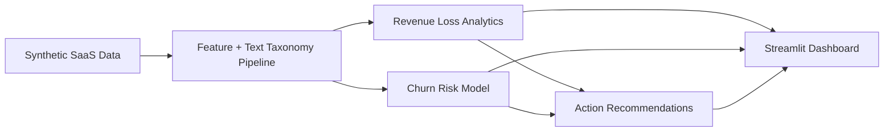

# Revenue Leak Detector

An end-to-end SaaS analytics system that identifies **why revenue is lost** across churn and lost deals, then prioritizes the **highest-impact actions** to recover growth.

This project implements the full scope in `project_spec.md`: synthetic data generation, taxonomy-based text intelligence, churn modeling, revenue impact analysis, and an interactive Streamlit application.

## Why this stands out

- Solves a real business problem: revenue leakage in a subscription SaaS context.
- Integrates structured + unstructured data (`usage`, `tickets`, `sales notes`, `cancellations`).
- Produces both **diagnostics** (root causes) and **prescriptive outputs** (action recommendations).
- Ships as a complete product: pipeline + model artifacts + dashboard.

## Latest run snapshot (from local pipeline output)

| Metric | Value |
|---|---:|
| Total modeled revenue leakage | `$1,647,354` |
| Lost-deal leakage | `$1,630,092` |
| Churn leakage | `$17,262` |
| Monthly revenue at risk (account scoring) | `$40,826.67` |
| High/Critical risk accounts | `221` |
| ROC-AUC | `0.6539` |
| Recall (optimized threshold) | `0.9057` |

Top revenue-loss categories:
1. `Product` — `$1,006,119`
2. `Competitive` — `$315,444`
3. `Commercial` — `$164,079`

## System architecture



## Core capabilities

- **Data Generation**: realistic SaaS tables for accounts, deals, product usage, support tickets, sales notes, cancellations.
- **Text Classification**: maps text evidence into a revenue-loss taxonomy:
  - Commercial
  - Product
  - Operational
  - Competitive
  - Adoption / Value Realization
- **Churn Modeling**: Random Forest classifier with threshold tuning for higher recall.
- **Revenue Impact Analysis**:
  - leakage by category/subcategory
  - churn vs lost-deal split
  - monthly trends
  - segment-level exposure
- **Recommendations Engine**: category-prioritized operating actions.
- **Interactive App**:
  - KPI summary cards
  - category trend visualizations
  - at-risk account drill-down
  - segment impact view
  - evidence explorer for notes/tickets/cancellations

## Repository structure

```text
Revenue-Leak-Detector/
├── app.py
├── project_spec.md
├── data_schema.md
├── requirements.txt
├── docs/
│   └── PROJECT_COMPLETION.md
├── data/
│   └── raw/
├── src/
│   ├── generate_data.py
│   ├── run_pipeline.py
│   └── revenue_leak/
│       ├── config.py
│       ├── text_taxonomy.py
│       ├── features.py
│       ├── modeling.py
│       ├── analytics.py
│       ├── recommendations.py
│       └── pipeline.py
```

## Quickstart

### 1) Install dependencies

```bash
pip install -r requirements.txt
```

### 2) Generate data (optional)

```bash
python -m src.generate_data
```

### 3) Run full analytics + modeling pipeline

```bash
python -m src.run_pipeline
```

Outputs created:
- `data/processed/*.csv`
- `artifacts/churn_model.joblib`
- `artifacts/model_metrics.json`

### 4) Launch dashboard

```bash
streamlit run app.py
```

## Dashboard walkthrough

- **Revenue Loss Breakdown**: leakage by category and source.
- **Revenue Loss Trend**: monthly churn and lost-deal trendline.
- **At-Risk Accounts**: prioritized account table by expected revenue at risk.
- **Most Affected Segments**: plan/region/industry leakage concentration.
- **Model Quality**: ROC-AUC, PR-AUC, accuracy, recall, F1.
- **Evidence Explorer**: inspect the exact text evidence driving category classifications.

## Tech stack

- Python
- Pandas, NumPy
- Scikit-learn
- Streamlit
- Plotly
- Joblib

## Project completion mapping

Spec-to-implementation mapping is documented in:
- `docs/PROJECT_COMPLETION.md`

## Notes

- All business entities (`DesignFlow`) and datasets are synthetic.
- This project is portfolio-focused and demonstrates applied analytics, machine learning, and productized data storytelling in one deliverable.
